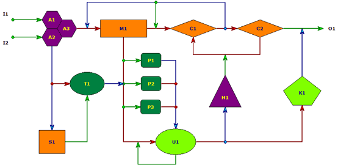
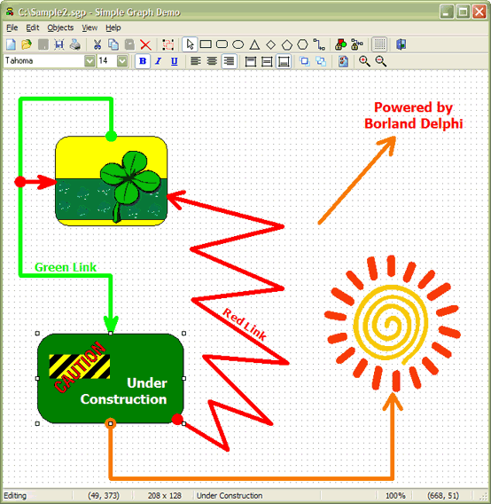

Description
===========
[TSimpleGraph](Docs/TSimpleGraph.md) is a visual Delphi component, which provides a canvas for drawing [simple directed graphs](https://mathworld.wolfram.com/SimpleDirectedGraph.html). 

The control has the following predefined node types for basic geometric shapes: 
  
  - Triangle
  - Rhomboid
  - Rectangle
  - Rounded Rectangle
  - Pentagon
  - Hexagon
  - Ellipse 
  
By overriding one or two methods, a new node type can be derived easily from one of the existing node classes.
  
The control has one predefined link (edge) type. Each endpoint of a link can be anchored to a node or another link.

The repository contains the source code of a Delphi application, which demonstrates the features of the [TSimpleGraph](Docs/TSimpleGraph.md) control in action.

See the [documentation](Docs/README.md) for details.

Installation
============
Add the following file into a new or existing package:

- `SimpleGraph.pas`

The following packages must be added to the requires clause of your package:

- `VCL`
- `RTL` (for Delphi 6 or higher only)
- `DesignIDE` (for design-time package of Delphi 6 or higher only)

Ensure `SimpleGraph.pas` and `DELPHIAREA.INC` files are in the search path of your Delphi installation.